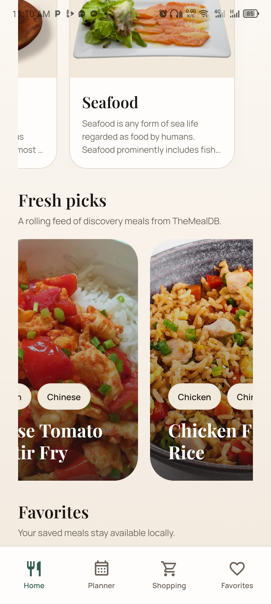
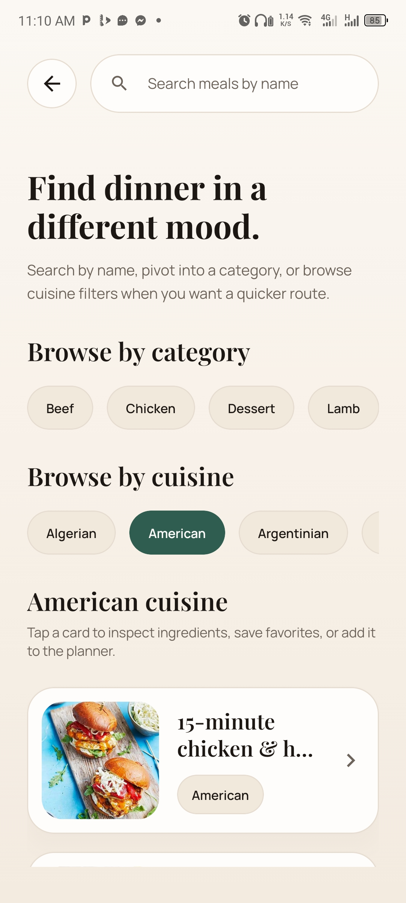
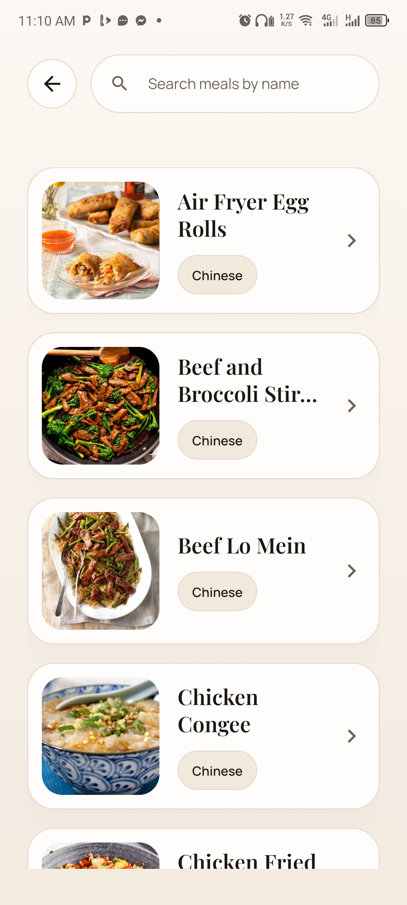
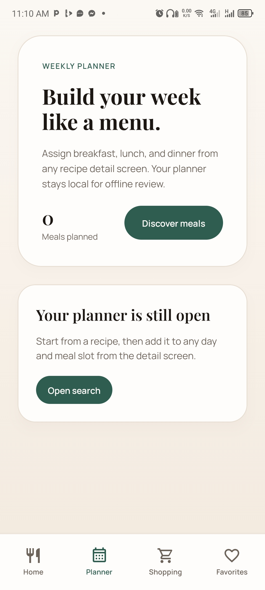
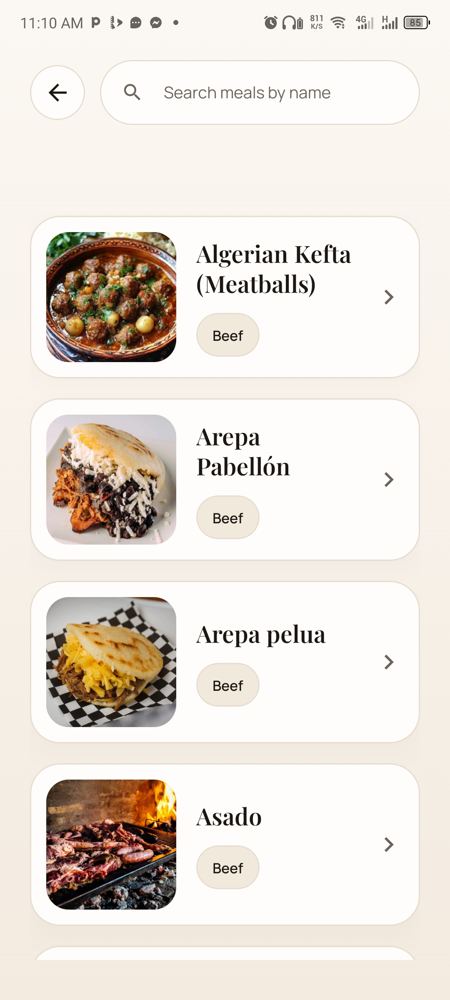
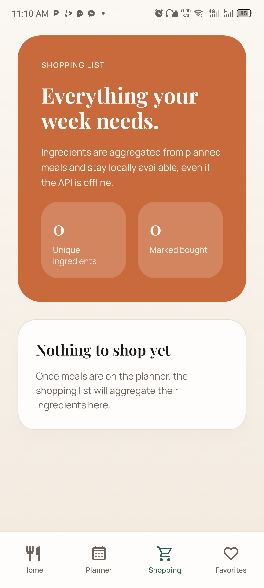
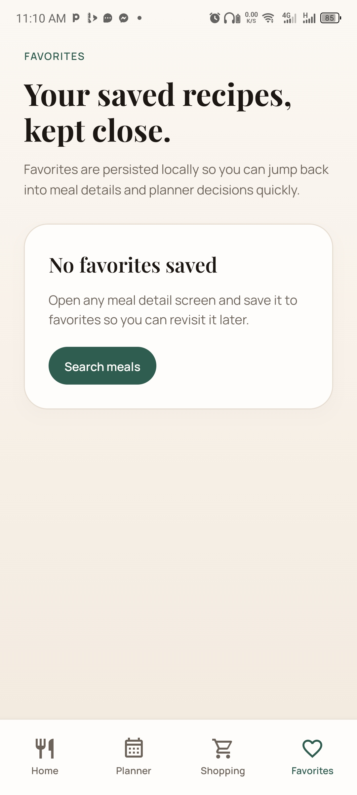

# NutriChef 🍽

A recipe discovery and meal planning app designed to help users find meals, plan weekly menus, and generate shopping lists.

## 🚀 Features

- 🔍 Search recipes by name
- 🍛 Browse meals by category
- 📖 Detailed recipe instructions
- 🥗 Ingredient breakdown
- ⭐ Save favorite meals
- 📅 Weekly meal planner
- 🛒 Auto-generated shopping list

## 🧠 What this project demonstrates

- Complex API data parsing
- Dynamic UI rendering
- Local state management for planning
- Aggregation logic (shopping list)
- UX-focused design for everyday use

## 📱 Demo

- APK: https://expo.dev/accounts/druidivine/projects/nutrichef/builds/b305c740-8d3a-4639-aee9-cfc4403aeb5c
- Video: https://drive.google.com/file/d/1UYU4a1toanvejU6iQ8Y3Z4JEjvwpdfuD/view?usp=sharing

## 🛠 Tech Stack

- React Native (Expo)
- TypeScript
- Zustand
- AsyncStorage
- TheMealDB API

## 📸 Screenshots

      

## 📦 Installation

```bash
git clone https://github.com/yourusername/nutrichef-mobile
cd nutrichef-mobile
npm install
npx expo start